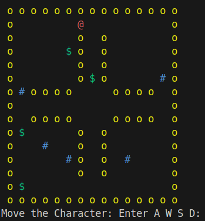

:us:

## About the project

This project was developed in the contex of an Operational Systems Undergrad course at Universidade de São Paulo (USP). The goal of this project is to develop an interactive game using Threads and Semaphores in C++, to bridge the gap between theory seen during the course and actual implementation of multi-threaded systems.

## Participants

Cauê Paiva Lira

Ayrton Filho

Pedro Henrique

Pedro Lucas

## About the game



The game is called **"Cops and Robbers"** and it consists of a robber, controlled by the player, who has to collect all the money in the game board and of cops, controlled by AI, who need to catch the robber (Player) and cause a Game Over.

If the player can collect all the money he **wins** the game, if a cop catches him, its **game over**. The game has 2 maps, which are randomly choosen, one with a cross and one with an X on the middle of the board.

The game is rendered on the terminal in colors.

## Implementation

###  Board class

This class groups the data and behavior necessary to represent the game board and all its elements. It has an enum for the state of each board tile (Wall,Empty,Robber,Cop,Money) and stores a matrix of these elements. Moreover it has the internal methods to generate the 2 game maps and a Random Number Generator to choose between the 2. Finally, functions to acess the board to read a tile state or change it are implemented, allowing for a safe interface to the underlying Data.

### Game class

This class implements the game logic with Threads and Semaphores. It implements a Thread for: user input, drawing the map, movement of each cop. Moreover, there are methods for the simple AI guiding the movements of the cops and for checking whether the game is in a victory or game over state. Finally, semaphores and mutexes are used to control acess to the critical region (Game Board and its cells/tiles) in this multi-threaded environment


## Running the project

Its simple! Our makefile automatically compiles and executes the program with make run

```bash
make run
```

:br: