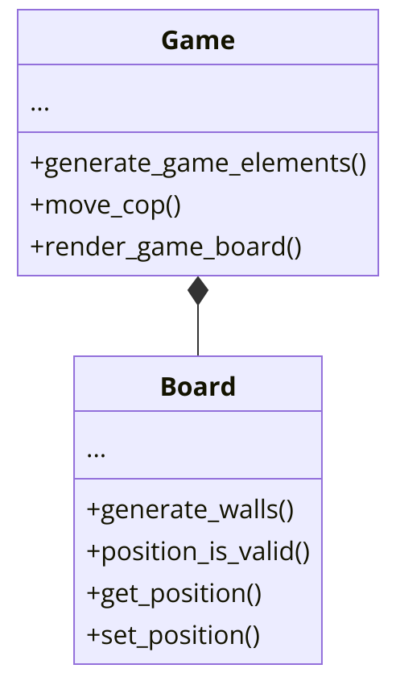

:us:

## About the project

This project was developed in the contex of an Operational Systems Undergrad course at Universidade de São Paulo (USP). The goal of this project is to develop an interactive game using **Threads and Semaphores in C++**, to bridge the gap between theory seen during the course and actual implementation of **multi-threaded systems**.

## Participants

Cauê Paiva Lira

Ayrton Filho

Pedro Henrique

Pedro Lucas

## About the game


The game is called **"Cops and Robbers"** and it consists of a robber, controlled by the player, who has to collect all the money in the game board and of cops, controlled by AI, who need to catch the robber (Player) and cause a Game Over.

If the player can collect all the money he **wins** the game, if a cop catches him, its **game over**. The game has 2 maps, which are randomly choosen, one with a cross and one with an X on the middle of the board.

The game is rendered on the terminal in colors.

## Implementation



###  Board class

This class groups the data and behavior necessary to represent the game board and all its elements. It has an enum for the state of each board tile (Wall,Empty,Robber,Cop,Money) and stores a matrix of these elements. Moreover it has the internal methods to generate the 2 game maps and a Random Number Generator to choose between the 2. Finally, functions to acess the board to read a tile state or change it are implemented, allowing for a safe interface to the underlying Data.

### Game class

This class implements the game logic with Threads and Semaphores. It implements a Thread for: user input, drawing the map, movement of each cop. Moreover, there are methods for the simple AI guiding the movements of the cops and for checking whether the game is in a victory or game over state. Finally, semaphores and mutexes are used to control acess to the critical region (Game Board and its cells/tiles) in this multi-threaded environment


## Running the project

Its simple! Our makefile automatically compiles and executes the program with make run

```bash
make run
```

<br>
<br>
<br>

:br:

## Sobre o projeto

Este projeto foi desenvolvido no contexto da disciplina de Sistemas Operacionais na graduação da Universidade de São Paulo (USP). O objetivo deste projeto é desenvolver um jogo interativo usando **Threads e Semáforos em C++**, para aproximar a teoria vista durante o curso da implementação prática de **sistemas multithread**.

## Participantes

Cauê Paiva Lira

Ayrton Filho

Pedro Henrique

Pedro Lucas

## Sobre o jogo


O jogo se chama **"Polícia e Ladrão"** e consiste em um ladrão, controlado pelo jogador, que precisa coletar todo o dinheiro no tabuleiro, e em policiais, controlados pela IA, que precisam capturar o ladrão (Jogador) e causar um Game Over.

Se o jogador conseguir coletar todo o dinheiro, ele **vence** o jogo, se um policial o pegar, é **Game Over**. O jogo possui 2 mapas, escolhidos aleatoriamente, um com uma cruz e outro com um X no meio do tabuleiro.

O jogo é renderizado no terminal em cores.

## Implementação


### Classe Board (Tabuleiro)

Esta classe agrupa os dados e comportamentos necessários para representar o tabuleiro do jogo e todos os seus elementos. Ela possui um enum para o estado de cada célula do tabuleiro (Parede, Vazio, Ladrão, Policial, Dinheiro) e armazena uma matriz desses elementos. Além disso, possui métodos internos para gerar os 2 mapas do jogo e um Gerador de Números Aleatórios para escolher entre eles. Finalmente, funções para acessar o tabuleiro, ler o estado de uma célula ou alterá-lo, fornecendo uma interface segura para os dados subjacentes.

### Classe Game (Jogo)

Esta classe implementa a lógica do jogo com Threads e Semáforos. Ela implementa uma Thread para: entrada do usuário, desenho do mapa, movimento de cada policial. Além disso, há métodos para a IA simples que orienta os movimentos dos policiais e para verificar se o jogo está em estado de vitória ou fim de jogo. Por fim, semáforos e mutexes são utilizados para controlar o acesso à região crítica (Tabuleiro do Jogo e suas células) neste ambiente multithread.

## Executando o projeto

É simples! Nosso makefile compila e executa o programa automaticamente com `make run`:

```bash
make run
